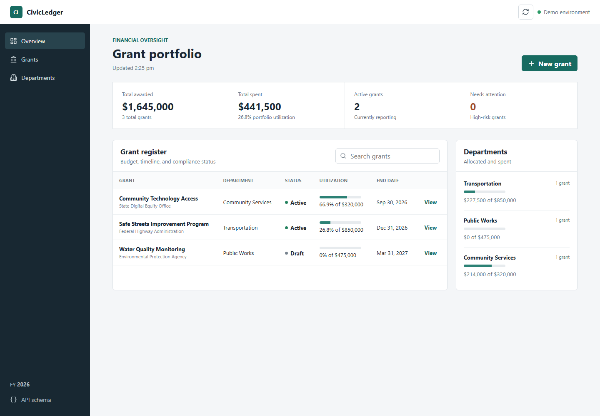

# CivicLedger

CivicLedger is a municipal grant and budget oversight application built with
ASP.NET Core, C#, Entity Framework Core, SQLite, and a responsive browser
dashboard. It helps public-sector teams track awards, expenses, utilization,
risk indicators, and audit history in one place.



## Highlights

- REST API for grant creation, activation, expense reporting, dashboards, and
  risk assessment
- Domain rules that prevent overspending, out-of-period expenses, and invalid
  grant state transitions
- SQLite persistence through Entity Framework Core with relational indexes and
  precision configuration
- Explainable risk scoring based on budget utilization, timeline progress,
  deadline proximity, and expense concentration
- Automatic audit history for grant and expense events
- Responsive operational dashboard served directly by ASP.NET Core
- xUnit coverage for budget rules, state validation, audit behavior, and risk
  scoring
- GitHub Actions workflow for restore, build, and test

## Architecture

```text
src/
  CivicLedger.Domain/          Entities and business rules
  CivicLedger.Application/     Use cases, DTOs, interfaces, risk service
  CivicLedger.Infrastructure/  EF Core DbContext and repository
  CivicLedger.Api/             HTTP endpoints and browser dashboard
tests/
  CivicLedger.Tests/           Domain and application unit tests
```

The dependency direction keeps the domain independent from infrastructure:

```text
API -> Application -> Domain
API -> Infrastructure -> Application + Domain
```

## Run locally

Requirements: [.NET 9 SDK](https://dotnet.microsoft.com/download/dotnet/9.0)

```powershell
dotnet restore
dotnet run --project src/CivicLedger.Api
```

Open the URL shown in the terminal. The application creates a local SQLite
database and seeds three sample municipal grants on first launch.

## Test

```powershell
dotnet test
```

## API endpoints

| Method | Route | Purpose |
| --- | --- | --- |
| `GET` | `/api/health` | Service health |
| `GET` | `/api/dashboard` | Portfolio totals grouped by department |
| `GET` | `/api/grants` | List grants with expenses and audit history |
| `GET` | `/api/grants/{id}` | Retrieve one grant |
| `POST` | `/api/grants` | Create a grant |
| `POST` | `/api/grants/{id}/activate` | Activate a draft grant |
| `POST` | `/api/grants/{id}/expenses` | Record and validate an expense |
| `GET` | `/api/grants/{id}/risk` | Calculate explainable risk indicators |

In development, the OpenAPI document is available at `/openapi/v1.json`.

## Example request

```http
POST /api/grants
Content-Type: application/json

{
  "name": "Neighborhood Safety Initiative",
  "department": "Public Safety",
  "fundingSource": "State Community Fund",
  "awardedAmount": 250000,
  "startDate": "2026-01-01",
  "endDate": "2026-12-31"
}
```

## Next iterations

- JWT authentication and role-based authorization
- PostgreSQL production configuration and EF Core migrations
- Angular client with generated API types
- CSV import/export and scheduled compliance reminders
- Optional Azure OpenAI narrative summaries behind an `IRiskNarrativeService`

## Resume description

**CivicLedger - Municipal Grant and Budget Oversight Platform**

- Built a full-stack municipal grant-management application using C#,
  ASP.NET Core, Entity Framework Core, SQLite, REST APIs, HTML, CSS, and
  JavaScript, with grant workflows, expense validation, dashboards, and
  audit-history tracking.
- Implemented explainable risk scoring, layered architecture, relational data
  access, seeded demo data, OpenAPI documentation, xUnit tests, and GitHub
  Actions CI for repeatable build and test validation.
